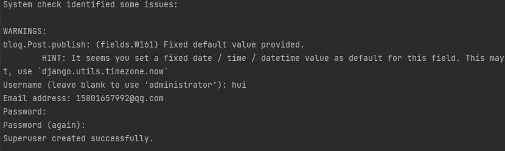

# Django 项目

## 1.安装django

```
pip install django
```

## 2.创建Django项目

```
>>>django-admin  startproject  项目名
```

## 3.创建APP

```
>>>cd 项目目录
>>>python manange.py startapp app名称
```

## 4.注册app(settings.py)

```python
INSTALLED_APPS = [
    'django.contrib.admin',
    'django.contrib.auth',
    'django.contrib.contenttypes',
    'django.contrib.sessions',
    'django.contrib.messages',
    'django.contrib.staticfiles',
    'app01.apps.App01Config' #app注册
]
```

- static目录，静态文件目录
- templates目录，模板文件目录（HTML）

## 5.数据库配置

```python
DATABASES = {
    'default': {
        'ENGINE': 'django.db.backends.mysql',
        'NAME': 'blog',  # 数据库名字
        'USER': 'root',
        'PASSWORD': '123456',
        'HOST': '127.0.0.1',  # 那台机器安装了MySQL
        'PORT': 3306,
    }
}
```

## 6.启用media

在urls.py中进行配置：

```
from django.urls import path, re_path
from django.views.static import serve
from django.conf import settings

urlpatterns = [
	re_path(r'^media/(?P<path>.*)$', serve, {'document_root': settings.MEDIA_ROOT}, name='media'),
]
```

在settings.py中进行配置：

```
import os

MEDIA_ROOT = os.path.join(BASE_DIR, "media")
MEDIA_URL = "/media/"
```

## 7.分页组件

```python
"""
自定义的分页组件，以后如果想要使用这个分页组件，你需要做如下几件事：

在视图函数中：
    def pretty_list(request):

        # 1.根据自己的情况去筛选自己的数据
        queryset = models.PrettyNum.objects.all()

        # 2.实例化分页对象
        page_object = Pagination(request, queryset)

        context = {
            "queryset": page_object.page_queryset,  # 分完页的数据
            "page_string": page_object.html()       # 生成页码
        }
        return render(request, 'pretty_list.html', context)

在HTML页面中

    
        {{obj.xx}}
    

    <ul class="pagination">
        {{ page_string }}
    </ul>

"""

from django.utils.safestring import mark_safe


class Pagination(object):

    def __init__(self, request, queryset, page_size=10, page_param="page", plus=5):
        """
        :param request: 请求的对象
        :param queryset: 符合条件的数据（根据这个数据给他进行分页处理）
        :param page_size: 每页显示多少条数据
        :param page_param: 在URL中传递的获取分页的参数，例如：/etty/list/?page=12
        :param plus: 显示当前页的 前或后几页（页码）
        """

        from django.http.request import QueryDict
        import copy
        query_dict = copy.deepcopy(request.GET)
        query_dict._mutable = True
        self.query_dict = query_dict

        self.page_param = page_param
        page = request.GET.get(page_param, "1")

        if page.isdecimal():
            page = int(page)
        else:
            page = 1

        self.page = page
        self.page_size = page_size

        self.start = (page - 1) * page_size
        self.end = page * page_size

        self.page_queryset = queryset[self.start:self.end]

        total_count = queryset.count()
        total_page_count, div = divmod(total_count, page_size)
        if div:
            total_page_count += 1
        self.total_page_count = total_page_count
        self.plus = plus

    def html(self):
        # 计算出，显示当前页的前5页、后5页
        if self.total_page_count <= 2 * self.plus + 1:
            # 数据库中的数据比较少，都没有达到11页。
            start_page = 1
            end_page = self.total_page_count
        else:
            # 数据库中的数据比较多 > 11页。

            # 当前页<5时（小极值）
            if self.page <= self.plus:
                start_page = 1
                end_page = 2 * self.plus + 1
            else:
                # 当前页 > 5
                # 当前页+5 > 总页面
                if (self.page + self.plus) > self.total_page_count:
                    start_page = self.total_page_count - 2 * self.plus
                    end_page = self.total_page_count
                else:
                    start_page = self.page - self.plus
                    end_page = self.page + self.plus

        # 页码
        page_str_list = []

        self.query_dict.setlist(self.page_param, [1])
        page_str_list.append('<li><a href="?{}">首页</a></li>'.format(self.query_dict.urlencode()))

        # 上一页
        if self.page > 1:
            self.query_dict.setlist(self.page_param, [self.page - 1])
            prev = '<li><a href="?{}">上一页</a></li>'.format(self.query_dict.urlencode())
        else:
            self.query_dict.setlist(self.page_param, [1])
            prev = '<li><a href="?{}">上一页</a></li>'.format(self.query_dict.urlencode())
        page_str_list.append(prev)

        # 页面
        for i in range(start_page, end_page + 1):
            self.query_dict.setlist(self.page_param, [i])
            if i == self.page:
                ele = '<li class="active"><a href="?{}">{}</a></li>'.format(self.query_dict.urlencode(), i)
            else:
                ele = '<li><a href="?{}">{}</a></li>'.format(self.query_dict.urlencode(), i)
            page_str_list.append(ele)

        # 下一页
        if self.page < self.total_page_count:
            self.query_dict.setlist(self.page_param, [self.page + 1])
            prev = '<li><a href="?{}">下一页</a></li>'.format(self.query_dict.urlencode())
        else:
            self.query_dict.setlist(self.page_param, [self.total_page_count])
            prev = '<li><a href="?{}">下一页</a></li>'.format(self.query_dict.urlencode())
        page_str_list.append(prev)

        # 尾页
        self.query_dict.setlist(self.page_param, [self.total_page_count])
        page_str_list.append('<li><a href="?{}">尾页</a></li>'.format(self.query_dict.urlencode()))

        search_string = """
            <li>
                <form style="float: left;margin-left: -1px" method="get">
                    <input name="page"
                           style="position: relative;float:left;display: inline-block;width: 80px;border-radius: 0;"
                           type="text" class="form-control" placeholder="页码">
                    <button style="border-radius: 0" class="btn btn-default" type="submit">跳转</button>
                </form>
            </li>
            """

        page_str_list.append(search_string)
        page_string = mark_safe("".join(page_str_list))
        return page_string

```

## 8.中间件

```
- 类 process_request / process_response
- 注册中间件类settings.py
    MIDDLEWARE = [
        'django.middleware.security.SecurityMiddleware',
        'django.contrib.sessions.middleware.SessionMiddleware',
        'django.middleware.common.CommonMiddleware',
        'django.middleware.csrf.CsrfViewMiddleware',
        'django.contrib.auth.middleware.AuthenticationMiddleware',
        'django.contrib.messages.middleware.MessageMiddleware',
        'django.middleware.clickjacking.XFrameOptionsMiddleware',
        'app01.middleware.auth.AuthMiddleware',
    ]
- django请求到达之后，自动会执行相应的方法。

- process_request
	- 没有返回值或返回None，继续向后执行。
	- 返回redirect/render/HttpResponse/JsonReponse，拦截请求不再继续向后之后。
```

## 9.表结构设计(app01/modes.py)

```python
from django.db import models

class UserInfo(models.Model):
    v1 = models.CharField(max_length=32)
    ...
    ..
```

```
>>>python manage.py makemigrations
>>>python manage.py migrate
```

## 10.编写路由(urls.py )

```python
from django.urls import path,re_path
from app01 import admin


urlpatterns = [
    path('admin/list/', admin.admin_list),
    path('admin/<int:nid>/delete/', admin.admin_delete),
    re_path('admin/(?P<nid>\d+)/delete/', admin.admin_delete)
]
```

## 11.视图函数(views)

```python
def admin_list(request):
    k1 = request.POST.get("k1")
    
    ... 业务处理
    
    return 数据

- 默认参数request，包含请求相关的所有数据。
	request.method
    request.GET
    request.POST
    request.FILES，上传文件。
    request.path_info，获取当前请求的URL
    	http://127.0.0.1:8000/depart/add/  ->    /depart/add/
                
- 返回值
	return HttpResponse("字符串")
	return JSONResponse( {"status":123,"data":[456,55,66,22,]} )
		return JSONResponse( [11,22,33,44] ,safe=False)
	return render(request,"xxx.html",{值})
	return redirect("http://127.0.0.1:8000/depart/add/")
			return redirect("/depart/add/")
```

## 12.数据库的ORM操作

```python
# 增加
models.类.objects.create(name="武沛齐",age=19)
models.类.objects.create(**{"name":"武沛齐","age":19})

obj = models.类(name="武沛齐",age=19)
obj.save()

obj_list = [
    models.类(name="武沛齐",age=19),
    models.类(name="武沛齐",age=19),
    models.类(name="武沛齐",age=19),
    models.类(name="武沛齐",age=19),
    models.类(name="武沛齐",age=19)
    。。。
]
models.类.objects.bulk_create(obj_list,batch_size=10)
```

```python
# 查询
queyrset = models.类.objects.filter(name="武沛齐",age=19)         # [obj,obj,]
queyrset = models.类.objects.filter(**{"name":"武沛齐","age":19}) # []
obj = models.类.objects.filter(name="武沛齐",age=19).first()      # obj / None

queyrset = models.类.objects.filter(age=19)
queyrset = models.类.objects.filter(age__gt=19)
queyrset = models.类.objects.filter(age__gte=19)
queyrset = models.类.objects.filter(age__lt=19)
queyrset = models.类.objects.filter(age__lte=19)
queyrset = models.类.objects.filter(age__gt=19, name="武沛齐")
queyrset = models.类.objects.filter(name__contains="中国")
queyrset = models.类.objects.exclude(id=9)  # id !=9

queyrset = models.类.objects.filter(age=19).order_by("id")
queyrset = models.类.objects.filter(age=19).order_by("-id")
queyrset = models.类.objects.filter(age=19).order_by("-id","name")

queyrset = models.类.objects.filter(age=19)[0:10]
```

```python
# 更新
queyrset = models.类.objects.filter(id=2).update(age=19,name="武沛齐")
queyrset = models.类.objects.filter(id=2).update(**{"name":"武沛齐","age":19})


obj = models.类.objects.filter(id=2).first()
obj.name = "武沛齐"
obj.age = 19
obj.save()
```

```python
# 删除
models.类.objects.filter(id=2).delete()
```

```
整理的所有ORM操作：
	https://www.cnblogs.com/wupeiqi/articles/6216618.html
```

## 13.Form和ModelForm组件

```
- 自动生成HTML标签
- 对用户请求的数据进行校验
	- 自动保存到数据库（ModelForm）
- 错误信息
```

```python
from django import forms

class UserForm(forms.Form):
    xx = forms.CharField(...)
    
    
class UserModelForm(forms.ModelForm):
    class Meta:
        model = models.类
        fields = "__all__"    
```

```python
form = UserModelForm(data=request.POST,instance=对象)
if form.is_valid():
    form.cleaned_data
else:
    form.errors
```

- 关于POST提交CSRF认证

  ```html
  <form method='post'>
      
      ...
  </form>
  ```

  如果想要免除csrf认证。

  ```python
  from django.views.decorators.csrf import csrf_exempt
  
  @csrf_exempt
  def order_add(request):
      pass
  ```

- Cookie和Session

  ```
  cookie，本质上保存在浏览器端的键值对。 
  session，保存服务器端（django是将session默认存储在数据库中）
  
  def order_add(request):
      request.session['xx'] = 123
      
  def logout(request):
  	request.session.clear()
  ```

图片验证码

```
pip install pillow
```

```
- 创建图片并在图片上写文字
- 字体文件
- 自定义模块 check_code
```

## 14.创建超级用户

 使用管理后台，需要先注册一个超级用户，输入下列命令： 

```
python manage.py createsuperuser
```

 看到下列输出，输入用户名、密码和邮件： 

