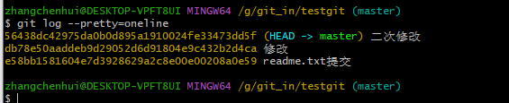
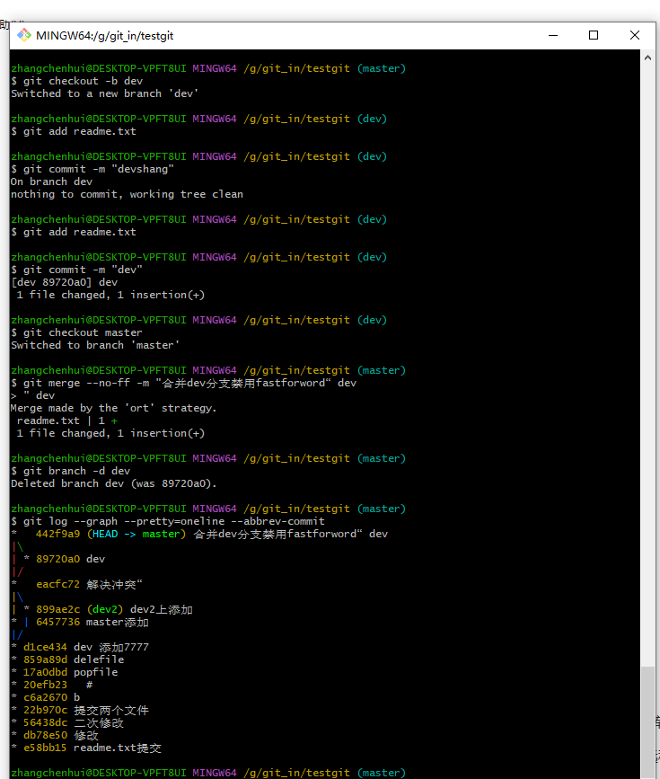

# 1. django基础知识

### 1.1 基础知识

1. MVT模式：Django采用的是Model-View-Template模式，将应用程序分为数据模型（Model）、视图（View）和模板（Template）三个部分。

   | 层次                           | 职责                                                         |
   | ------------------------------ | ------------------------------------------------------------ |
   | 模型（Model），即数据存取层    | 处理与数据相关的所有事务： 如何存取、如何验证有效性、包含哪些行为以及数据之间的关系等。 |
   | 模板（Template），即业务逻辑层 | 处理与表现相关的决定： 如何在页面或其他类型文档中进行显示。  |
   | 视图（View），即表现层         | 存取模型及调取恰当模板的相关逻辑。模型与模板的桥梁。         |

2. ORM：Django提供了自己的ORM（对象关系映射）工具，可以方便地访问和操作关系型数据库。

3. 自带管理后台：Django自带了一个强大的管理后台，可以方便地对数据库进行管理和维护。

4. 安全性：Django自带了一些安全性功能，如防止跨站脚本攻击、防止SQL注入等。

### 1.2 特性

1. 快速开发：Django的设计目标之一就是快速开发，它提供了很多现成的组件和工具，可以快速地搭建一个完整的Web应用程序。

2. 可扩展性：Django采用了松耦合的设计，可以方便地扩展和定制功能。

3. 社区支持：Django有一个庞大的社区，提供了很多优秀的第三方库和工具，可以方便地扩展和增强功能。

4. 丰富的文档和教程：Django有丰富的文档和教程，可以帮助新手快速上手。


### 1.3 优劣势

1. 优点：Django具有快速开发、可扩展性、安全性、丰富的文档和教程等优点。

2. 缺点：Django的性能相对较低，需要较多的服务器资源来支持高并发请求。


### 1.4 使用场景

1. 构建中小型Web应用程序，如博客、新闻网站、电子商务网站等。
2. 快速开发原型或测试应用程序，可以使用Django的快速开发特性，快速验证和测试想法。
3. 搭建内部管理系统或企业应用程序，Django自带的管理后台和安全性功能可以帮助开发者快速构建和维护系统。

### 1.5 项目文件说明

- **manage.py：**命令行工具，内置多种方式与项目进行交互。在命令提示符窗口下，将路径切换到django4blog项目并输入python manage.py help，可以查看该工具的指令信息。
- **__init__.py：**初始化文件，一般情况下无须修改。
- **asgi.py：**用于启动异步通信服务，比如实现在线聊天等异步通信功能。
- **settings.py：**项目的配置文件，项目的所有功能都需要在该文件中进行配置。
- **urls.py：**项目的路由设置，设置网站的具体网址内容。
- **wsgi.py：**全称为Python Web Server Gateway Interface，即Python服务器网关接口，是Python应用与Web服务器之间的接口，用于Django项目在服务器上的部署和上线，一般不需要修改。

### 1.6 app文件说明

- **__init__.py：**初始化文件，一般情况下无须修改。
- **admin.py：**后台管理的配置文件 , 后期我们的可以通过他管理我们的model和数据库。
- **apps.py：**django菜单文件。
- **models.py：**模型文件，用于创建模型和数据库表的映射关系，用于项目和数据库之间的数据处理。
- **views.py：**视图文件，用于实现我们具体的Web请求和返回响应。
- **tests.py：**测试文件。

### 1.7 Django内置APP说明

- **admin：**内置的后台管理系统。
- **auth**：内置的用户认证系统。
- **contenttypes**：记录项目中所有model元数据（Django的ORM框架）。
- **sessions：**Session会话功能，用于标识当前访问网站的用户身份，记录相关用户信息。
- **messages**：消息提示功能。
- **staticfiles**：查找静态资源路径。

#  2. RESTful API的基础知识和技能

 RESTful API是一种使用HTTP协议进行通信的应用程序接口设计风格，它具有可伸缩性、灵活性、可扩展性和安全性等优点。设计和开发RESTful API需要掌握以下基础知识和技能：

### 2.1 HTTP协议

RESTful API使用HTTP协议进行通信，因此需要了解HTTP协议的基本概念、请求方法、响应格式等内容。HTTP协议是一种无状态的协议，每个请求都是独立的，服务器不会保存任何状态信息。HTTP请求方法包括GET、POST、PUT、DELETE等，每个方法有不同的用途。HTTP响应格式包括状态行、消息头和消息体，状态行包含状态码和状态描述，消息头包含响应信息，消息体包含响应的数据。

### 2.2 请求和响应的格式

RESTful API的请求和响应都遵循一定的格式。请求格式通常包括HTTP方法、URL、消息头和消息体，消息体通常使用JSON或XML格式表示数据。响应格式通常包括状态码、消息头和消息体，消息体通常使用JSON或XML格式返回数据。请求和响应的格式应该符合RESTful API的设计原则，尽量简单、清晰、易于理解。

### 2.3 状态码

RESTful API使用状态码表示请求的处理结果，状态码是HTTP协议的一部分。常见的状态码包括200 OK、201 Created、400 Bad Request、401 Unauthorized、404 Not Found、500 Internal Server Error等，不同的状态码对应着不同的处理结果。

### 2.4 安全性

RESTful API需要考虑安全性问题，包括身份验证、授权、加密传输等。身份验证通常使用用户名和密码进行验证，授权通常使用令牌进行授权，加密传输通常使用SSL/TLS等协议进行加密。

### 2.5 跨域访问

RESTful API通常需要支持跨域访问，因此需要了解跨域访问的基本原理和解决方案。常见的解决方案包括CORS（跨域资源共享）和JSONP（JSON with Padding）等。

#  3. Linux操作系统的基本使用和操作 

Linux是一种自由和开放源代码的Unix类操作系统，具有高度的稳定性、安全性和灵活性。以下是Linux操作系统的基本使用和操作，包括命令行界面、文件操作、用户管理等：

### 3.1 命令行界面

Linux操作系统的默认界面是命令行界面，通常称为shell。用户可以使用不同的shell，例如Bash、Zsh和Fish等。命令行界面通过终端模拟器访问，可以执行各种系统管理任务和编程任务。

### 3.2 文件操作

在Linux系统中，一切皆文件，包括目录和设备等。常见的文件操作命令有：

- ls：列出当前目录中的文件和目录。
- cd：更改当前目录。
- mkdir：创建一个新目录。
- rm：删除一个文件或目录。
- cp：复制一个文件或目录。
- mv：移动或重命名一个文件或目录。

### 3.3 用户管理

Linux系统支持多用户登录和管理，每个用户都有自己的用户名和密码。常见的用户管理命令有：

- useradd：创建一个新用户。
- passwd：更改用户密码。
- su：切换到其他用户。
- sudo：以超级用户权限运行命令。

### 3.4 软件包管理

Linux系统使用软件包管理器来安装、升级和卸载软件包。常见的软件包管理器有：

- apt：用于Debian和Ubuntu等基于Debian的发行版。
- yum：用于CentOS、Fedora和Red Hat等基于Red Hat的发行版。
- pacman：用于Arch Linux和Manjaro等发行版。

### 3.5 系统监控

Linux系统提供了许多工具来监控系统资源和性能。常见的系统监控命令有：

1. top：显示运行中的进程和系统资源使用情况。
2. ps：列出当前用户的进程。
3. free：显示系统内存使用情况。
4. df：显示文件系统使用情况。

## 3.6 下载

#### 3.6.1 VMware 虚拟机安装

下载VMware-workstation 下一步即可（默认下载位置可更改）

https://customerconnect.vmware.com/cn/downloads/details?downloadGroup=WKST-1701-WIN&productId=1376

密钥：JU090-6039P-08409-8J0QH-2YR7F（失效网上自行搜索可随意使用）

##### 3.6.2 下载CentOS

http://mirrors.aliyun.com/centos/7.9.2009/isos/x86_64/

##### 3.6.3 配置

https://blog.csdn.net/H875035681/article/details/123153807

# 4. apache 配置使用

### 4.1 下载

1. 官方下载地址：http://[httpd](https://so.csdn.net/so/search?q=httpd&spm=1001.2101.3001.7020).apache.org/，目前最新版是：2.4.46
   进入官网点击Download进入； 

2. 点击Files for Microsoft Windows 

3. 进入windows下的软件下载页面，点击ApacheHaus 

4. 进入下载页面选择自己想使用的版本 

5. 将下载好的Apache Service软件解压，解压的时候注意指定解压路径 

6. 以管理员身份运行CMD，进入cmd后，cd 命令切换到G:\apache_in\Apache24\bin路径下；cmd.exe在C:\Windows\System32下，找到cmd.exe右键，选择“以管理员身份运行”；

   

7. 执行 httpd -k install

   

### 4.2 配置

打开httpd.conf文件，路径在D:\BaiduNetdiskDownload\Apache24\conf文件夹下；

修改两个地方

1. 为ServerRoot 配置正确的安装路径

 ServerRoot “D:/BaiduNetdiskDownload/Apache24”

2. 为DocumentRoot 配置正确的htdocs路径

DocumentRoot “D:/BaiduNetdiskDownload/Apache24/htdocs”

3. Define SRVROOT “/Apache24”

导致系统没有找到server.crt的路径。

只需要将httpd.conf的Define SRVROOT 路径改为解压路径

### 4.3 启动

 点击Services可以进入系统服务信息 


 如果端口被占用 ，修改端口


# 5. Git的基本使用

Git是一种常用的分布式版本控制系统，它可以跟踪文件的变化，协调多人协作开发，以及恢复已经删除或修改的文件版本等。下面是Git的基本使用以及分支、合并、冲突解决等基本操作。

### 5.1安装

msysgit是 windows版的Git ，需要从网上下载一个，然后进行默认安装即可。安装完成后，在开始菜单里面找到 "Git --> Git Bash",  会弹出一个类似的命令窗口的东西，就说明Git安装成功。 

 安装完成后，还需要最后一步设置，在命令行输入如下： 


Git是分布式版本控制系统，所以需要填写用户名和邮箱作为一个标识。

　　注意：git config --global 参数，有了这个参数，表示你这台机器上所有的Git仓库都会使用这个配置，当然你也可以对某个仓库指定的不同的用户名和邮箱

### 5.2 创建版本库

　　什么是版本库？版本库又名仓库，英文名repository,你可以简单的理解一个目录，这个目录里面的所有文件都可以被Git管理起来，每个文件的修改，删除，Git都能跟踪，以便任何时刻都可以追踪历史，或者在将来某个时刻还可以将文件”还原”


makedir:创建文件夹  pwd:显示当前目录

 通过命令 git init 把这个目录变成git可以管理的仓库 


此时 你当前testgit目录下会多了一个.git的目录，这个目录是Git来跟踪管理版本的，没事千万不要手动乱改这个目录里面的文件，否则，会把git仓库给破坏了 


　把文件添加到版本库中。

　　首先要明确下，**<u>所有的版本控制系统，只能跟踪文本文件的改动，比如txt文件，网页，所有程序的代码等</u>**，Git也不列外，版本控制系统可以告诉你每次的改动，但是图片，视频这些二进制文件，虽能也能由版本控制系统管理，但没法跟踪文件的变化，只能把二进制文件每次改动串起来，也就是知道图片从1kb变成2kb，但是到底改了啥，版本控制也不知道。

###  5.3 添加文件

在版本库testgit目录下新建一个记事本文件 readme.txt 内容如下：11111111 

 第一步 使用命令 git add readme.txt添加到暂存区里面去。 


 如果和上面一样，没有任何提示，说明已经添加成功了。 

 第二步：用命令 git commit告诉Git，把文件提交到仓库。 


 现在我们已经提交了一个readme.txt文件了，我们下面可以通过命令git status来查看是否还有文件未提交 


 说明没有任何文件未提交，但是我现在继续来改下readme.txt内容，比如我在下面添加一行2222222222内容，继续使用git status来查看下结果


　上面的命令告诉我们 readme.txt文件已被修改，但是未被提交的修改。

　　接下来我想看下readme.txt文件到底改了什么内容，git diff readme.txt 


 提交修改和提交文件是一样的2步(第一步是git add 第二步是：git commit)。 


### 5.4 版本回退

再次修改添加3333，查看历史记录git log


  git log命令显示从最近到最远的显示日志，我们可以看到最近三次提交，最近的一次是,增加内容为333333.上一次是添加内容222222，第一次默认是 111111.显示简洁信息，我们可以使用命令 git log –pretty=oneline  



 版本回退操作，我想把当前的版本回退到上一个版本  git reset --hard HEAD^ 那么如果要回退到上上个版本只需把HEAD^ 改成 HEAD^^ 以此类推。那如果要回退到前100个版本的话，使用上面的方法肯定不方便，我们可以使用下面的简便命令操作：git reset --hard HEAD~100 即可。 


 回退到最新的版本  　git reset --hard 版本号 ，但是现在的问题假如我已经关掉过一次命令行或者333内容的版本号我并不知道呢？要如何知道增加3333内容的版本号呢？可以通过如下命令即可获取到版本号：git reflog 演示如下：

 

### 5.5  工作区与暂存区的区别 

工作区：就是你在电脑上看到的目录，比如目录下testgit里的文件(.git隐藏目录版本库除外)。或者以后需要再新建的目录文件等等都属于工作区范畴。

　　版本库(Repository)：工作区有一个隐藏目录.git,这个不属于工作区，这是版本库。其中版本库里面存了很多东西，其中最重要的就是stage(暂存区)，还有Git为我们自动创建了第一个分支master,以及指向master的一个指针HEAD。

　　我们前面说过使用Git提交文件到版本库有两步：

　　第一步：是使用 git add 把文件添加进去，实际上就是把文件添加到暂存区。

　　第二步：使用git commit提交更改，实际上就是把暂存区的所有内容提交到当前分支上。


### 5.6 Git撤销修改和删除文件操作 

在readme.txt文件里面增加一行 内容为555555555555 

未提交之前，我发现添加5555555555555内容有误，所以我得马上恢复以前的版本，现在我可以有如下几种方法可以做修改：

　　第一：如果我知道要删掉那些内容的话，直接手动更改去掉那些需要的文件，然后add添加到暂存区，最后commit掉。

　　第二：我可以按以前的方法直接恢复到上一个版本。使用 git reset --hard HEAD^

​        第三：撤销


命令 git checkout --readme.txt 意思就是，把readme.txt文件在工作区做的修改全部撤销，这里有2种情况，如下：

1. readme.txt自动修改后，还没有放到暂存区，使用 撤销修改就回到和版本库一模一样的状态。

2. 另外一种是readme.txt已经放入暂存区了，接着又作了修改，撤销修改就回到添加暂存区后的状态。

   

    版本库testgit目录添加一个文件aa.txt,然后提交 rm aa.txt 删除文件，git rm aa.txt ,git commit -m 'delete 彻底删除'。 

   

### 5.7  创建与合并分支 

 每次提交，Git都把它们串成一条时间线，这条时间线就是一个分支。截止到目前，只有一条时间线，在Git里，这个分支叫主分支，即master分支。HEAD严格来说不是指向提交，而是指向master，master才是指向提交的，所以，HEAD指向的就是当前分支。 

 首先，我们来创建dev分支，然后切换到dev分支上。 


 dev分支工作已完成，现在我们切换到主分支master上，继续查看readme.txt 


 dev分支上的内容合并到分支master上了，可以在master分支上，使用如下命令 git merge dev  


git merge命令用于合并指定分支到当前分支上，合并后，再查看readme.txt内容，可以看到，和dev分支最新提交的是完全一样的。

　　注意到上面的Fast-forward信息，Git告诉我们，这次合并是“快进模式”，也就是直接把master指向dev的当前提交，所以合并速度非常快。

 合并完成后，我们可以接着删除dev分支 


### 5.8 冲突解决

创建分支dev2


 切换到master分支上来，也在最后一行添加内容，内容为99999999 


 需要在master分支上来合并dev2


 Git用<<<<<<<，=======，>>>>>>>标记出不同分支的内容，其中<<<HEAD是指主分支修改的内容，>>>>>dev2 是指dev2上修改的内容，我们可以修改下如下后保存： (手动解决冲突：编辑冲突文件，手动解决冲突。)


### 5.9 分支管理策略

 分支策略：首先master主分支应该是非常稳定的，也就是用来发布新版本，一般情况下不允许在上面干活，干活一般情况下在新建的dev分支上干活，干完后，比如上要发布，或者说dev分支代码稳定后可以合并到主分支master上来。 

　　通常合并分支时，git一般使用”Fast forward”模式，在这种模式下，删除分支后，会丢掉分支信息，现在我们来使用带参数 –no-ff来禁用”Fast forward”模式。首先我们来做demo演示下：

1. 创建一个dev分支。

2. 修改readme.txt内容。

3. 添加到暂存区。

4. 切换回主分支(master)。

5. 合并dev分支，使用命令 git merge –no-ff -m “注释” dev

6. 查看历史记录

   

### 5.10 bug分支

​        在开发中，会经常碰到bug问题，那么有了bug就需要修复，在Git中，分支是很强大的，每个bug都可以通过一个临时分支来修复，修复完成后，合并分支，然后将临时的分支删除掉。

　　比如我在开发中接到一个404 bug时候，我们可以创建一个404分支来修复它，但是，当前的dev分支上的工作还没有提交。

​       并不是我不想提交，而是工作进行到一半时候，我们还无法提交，比如我这个分支bug要2天完成，但是我issue-404 bug需要5个小时内完成。怎么办呢？还好，Git还提供了一个stash功能，可以把当前工作现场 ”隐藏起来”，等以后恢复现场后继续工作。 


所以现在我可以通过创建issue-404分支来修复bug了。

　　首先我们要确定在那个分支上修复bug，比如我现在是在主分支master上来修复的，现在我要在master分支上创建一个临时分支


 修复完成后，切换到master分支上，并完成合并，最后删除issue-404分支。 


 我们回到dev分支上 


 工作现场还在，Git把stash内容存在某个地方了，但是需要恢复一下，可以使用如下2个方法： 

1. git stash apply恢复，恢复后，stash内容并不删除，你需要使用命令git stash drop来删除。
2. 另一种方式是使用git stash pop,恢复的同时把stash内容也删除了。

### 5.11 远程库

　在了解之前，先注册github账号，由于你的本地Git仓库和github仓库之间的传输是通过SSH加密的，所以需要一点设置：

　　第一步：创建SSH Key。在用户主目录下，看看有没有.ssh目录，如果有，再看看这个目录下有没有id_rsa和id_rsa.pub这两个文件，如果有的话，直接跳过此如下命令，如果没有的话，打开命令行，输入如下命令：

　　ssh-keygen -t rsa –C “youremail@example.com”, 由于我本地此前运行过一次，所以本地有


id_rsa是私钥，不能泄露出去，id_rsa.pub是公钥，可以放心地告诉任何人。

　　第二步：登录github,打开” settings”中的SSH Keys页面，然后点击“Add SSH Key”,填上任意title，在Key文本框里黏贴id_rsa.pub文件的内容。 


 点击 Add Key，你就应该可以看到已经添加的key。 

如何添加远程库？

　　现在的情景是：我们已经在本地创建了一个Git仓库后，又想在github创建一个Git仓库，并且希望这两个仓库进行远程同步，这样github的仓库可以作为备份，又可以其他人通过该仓库来协作。

　　首先，登录github上，然后在右上角找到“new repository”创建一个新的仓库。如下：

 

 　在Repository name填入仓库名，其他保持默认设置，点击“Create repository”按钮，就成功地创建了一个新的Git仓库：  

目前，在GitHub上的这个testgit仓库还是空的，GitHub告诉我们，可以从这个仓库克隆出新的仓库，也可以把一个已有的本地仓库与之关联，然后，把本地仓库的内容推送到GitHub仓库。

　　现在，我们根据GitHub的提示，在本地的testgit仓库下运行命令：

　　git remote add origin https://github.com/tugenhua0707/testgit.git

把本地库的内容推送到远程，使用 git push命令，实际上是把当前分支master推送到远程。

　　由于远程库是空的，我们第一次推送master分支时，加上了 –u参数，Git不但会把本地的master分支内容推送的远程新的master分支，还会把本地的master分支和远程的master分支关联起来，在以后的推送或者拉取时就可以简化命令。推送成功后，可以立刻在github页面中看到远程库的内容已经和本地一模一样了，上面的要输入github的用户名和密码如下所示： 

　从现在起，只要本地作了提交，就可以通过如下命令：

　　git push origin master

　　把本地master分支的最新修改推送到github上了，现在你就拥有了真正的分布式版本库了。

### 5.12 Git基本常用命令

　　mkdir：     XX (创建一个空目录 XX指目录名)

　　pwd：     显示当前目录的路径。

　　git init     把当前的目录变成可以管理的git仓库，生成隐藏.git文件。

　　git add XX    把xx文件添加到暂存区去。

　　git commit –m “XX” 提交文件 –m 后面的是注释。

　　git status    查看仓库状态

　　git diff XX   查看XX文件修改了那些内容

　　git log     查看历史记录

　　git reset --hard HEAD^ 或者 git reset --hard HEAD~ 回退到上一个版本

　　(如果想回退到100个版本，使用git reset –hard HEAD~100 )

　　cat XX     查看XX文件内容

　　git reflog    查看历史记录的版本号id

　　git checkout -- XX 把XX文件在工作区的修改全部撤销。

　　git rm XX     删除XX文件

　　git remote add origin https://github.com/tugenhua0707/testgit 关联一个远程库

　　git push –u(第一次要用-u 以后不需要) origin master 把当前master分支推送到远程库

　　git clone https://github.com/tugenhua0707/testgit 从远程库中克隆

　　git checkout –b dev 创建dev分支 并切换到dev分支上

　　git branch 查看当前所有的分支

　　git checkout master 切换回master分支

　　git merge dev  在当前的分支上合并dev分支

　　git branch –d dev 删除dev分支

　　git branch name 创建分支

　　git stash 把当前的工作隐藏起来 等以后恢复现场后继续工作

　　git stash list 查看所有被隐藏的文件列表

　　git stash apply 恢复被隐藏的文件，但是内容不删除

　　git stash drop 删除文件

　　git stash pop 恢复文件的同时 也删除文件

　　git remote 查看远程库的信息

　　git remote –v 查看远程库的详细信息

　　git push origin master Git会把master分支推送到远程库对应的远程分支上

# 6. Redis 基本知识

### 6.1 优势

1. 高性能：Redis的性能极高，单线程处理请求，可以支持高并发读写操作。
2. 丰富的数据结构：Redis支持多种数据结构，包括字符串、哈希、列表、集合、有序集合等，支持各种复杂的数据处理操作。
3. 分布式：Redis支持分布式部署，可以通过多个节点构建Redis集群，实现数据的水平扩展和负载均衡。
4. 持久化：Redis支持数据持久化，可以将内存中的数据写入磁盘，保证数据的持久性和可靠性。
5. 支持事务：Redis支持事务操作，可以在多个操作之间执行原子性操作。

### 6.2 劣势

1. 单线程：虽然单线程能够支持高并发读写操作，但也意味着Redis无法利用多核CPU的性能优势。
2. 内存限制：Redis的数据存储是基于内存的，因此需要考虑服务器内存大小和数据量之间的平衡。
3. 不支持复杂查询：Redis不支持像关系型数据库那样的复杂查询语句，只能根据键查询数据，无法进行复杂的关联和过滤操作。

### 6.3 使用场景

1. 缓存：Redis可以作为高性能的缓存存储，可以减轻数据库的负载压力，提升网站的访问速度和用户体验。
2. 分布式锁：Redis可以通过实现分布式锁来解决多个进程之间的资源竞争问题，实现并发控制。
3. 消息队列：Redis的发布/订阅功能可以实现简单的消息队列，支持多个进程之间的消息传递。
4. 实时数据处理：Redis支持有序集合和时间序列数据结构，可以用于实时数据分析和处理。
5. 应用场景还包括排行榜、计数器、限流器等等。

### 6.4 安装

1. 安装redis数据库

2. python 中安装redis   pip install  redis

3. 连接

   ```python
   import redis
    
   redis_conn = redis.Redis(host='127.0.0.1', port= 6379, password= 'your pw', db= 0)
   ```

   ```python
   import redis
    
   redis_pool = redis.ConnectionPool(host='127.0.0.1', port= 6379, password= 'your pw', db= 0)
   redis_conn = redis.Redis(connection_pool= redis_pool)
   ```

### 6.5 常用数据结构

##### 6.5.1 String 字符串（键值对）

1. String set 设置单个键值 

   set(name, value, ex=None, px=None, nx=False, xx=False)

   ex：过期时间（秒），时间到了后redis会自动删除
   px：过期时间（毫秒），时间到了后redis会自动删除。ex、px二选一即可
   nx：如果设置为True，则只有name不存在时，当前set操作才执行
   xx：如果设置为True，则只有name存在时，当前set操作才执行

   ```
   redis_conn.set('name_2', 'Zarten_2')
   ```

2. String get 获取单个值

   ```
   v = redis_conn.get('name_1')
   print(v)
   ```

3. String mset 设置多个键值

   ```
   name_dict = {
       'name_4' : 'Zarten_4',
       'name_5' : 'Zarten_5'
   }
   redis_conn.mset(name_dict)
   ```

4. String mget 获取多个值

   mget(keys, *args)

   ```
   m = redis_conn.mget('name_1', 'name_2')
   #m = redis_conn.mget(['name_1', 'name_2']) 也行
   print(m) 
   ```

5. String getset 给已有的键设置新值，并返回原有的值

   getset(name, value)

   当所给的键不存在时，会设置其新值，但返回值为None

   ```
   v = redis_conn.getset('name_1', 'hi')
   ```

6. String setrange 根据索引修改某个键的value值

   setrange(name, offset, value)

   返回值为：修改后的字符串长度

   name：键，所给不存在时自动添加
   offset：偏移量，以0开始
   value：修改的字符或字符串，字符串时以offset向后顺延

   ```
   length = redis_conn.setrange('name_2', 1, 'zhihu')
   print(length) >>>>6
   ```

7.  String getrange 根据索引获取某个键的部分value值

   若所给的键不存在时，返回空值 b''

   getrange(key, start, end)

   ```
   v = redis_conn.getrange('name_4', 0, 2)
   >>>b'
   ```

8. String strlen 获取value的长度

   strlen(name)

   所给的键不存在时，返回值为0

   ```
   length = redis_conn.strlen('name_2')
   ```

9. String incr int类型的value自增（自减）

   同理：自减，decr(name, amount=1)

   所给的键对应的值必须是整数或字符串的数值，不然会报错。默认自增幅度为1

   incr(name, amount=1)

   返回值为：修改后的值，int类型

   ```
   redis_conn.set('num_2', 2)
   #redis_conn.set('num_2', '2') 都行
   
   v = redis_conn.incr('num_2')
   ```

10. String incrbyfloat 浮点数类型的value自增

    incrbyfloat(name, amount=1.0)

    返回值为：浮点数类型float

    ```
    v = redis_conn.incrbyfloat('num_2')
    ```

11. String append value后面追加

    append(key, value)

    若所给的键不存在，则设置新值

    返回值为修改后的字符串的长度

    ```
    length = redis_conn.append('name_5', '666')
    ```

##### 6.5.2 List 列表

在redis中，一个键对应一个列表

1. List lpush 列表左边添加值 rpush（右边）

   lpush(name, *values)

   value值有多个时，从左到右依次向列表左边添加，类型可以不同

   所给的键不存在时，新建一个列表

   返回值：列表的大小

   ```
   v = redis_conn.lpush('Zarten', 1,2,3,4,5)
   #v = redis_conn.lpush('Zarten', 6)
   ```

2. List lpushx 键存在时，添加到列表左边 rpushx（最右边）

   lpushx(name, value)

   只有键存在时，才添加。若键不存在则不添加，也不新创建列表

   返回值为：列表大小

   ```
   v = redis_conn.lpushx('Zarten_1', 'hehe')
   ```

3. List llen 获取所给键的列表大小

   llen(name)

   ```
   v = redis_conn.llen('Zarten')
   ```

4. List linsert 在列表中间插入新值

   linsert(name, where, refvalue, value)

   name：键名
   where：位置，前面（BEFORE）或后面（AFTER）
   refvalue：指定哪个值的前后插入
   value：插入的新值
   返回值：插入后列表的长度，若返回-1，则refvalue不存在

   ```
   v = redis_conn.linsert('Zarten', 'AFTER', 6, 'b')
   ```

5. List lset 列表中通过索引赋值

   lset(name, index, value)

   返回值：成功 True 否则 False

   ```
   v = redis_conn.lset('Zarten', 2, 'cc')
   ```

6. List lindex 通过索引获取列表值

   lindex(name, index)

   ```
   v = redis_conn.lindex('Zarten', 2)
   ```

7. List lrange 列表中获取一段数据

   lrange(name, start, end)

   返回值：List类型的一段数据

   ```
   v = redis_conn.lrange('Zarten', 2, 5)
   ```

8. List lpop 删除左边的第一个值 rpop（右边）

   lpop(name)

   返回值：被删除元素的值

   ```
   v = redis_conn.rpop('Zarten')
   ```

9. List lrem 删除列表中N个相同的值

   lrem(name, value, num=0)

   name：键名
   value：需删除的值
   num：删除的个数 整数表示从左往右 负数表示从右往左 例如：2 -2
   返回值：返回删除的个数

   ```
   v = redis_conn.lrem('Zarten', 'hehe', -2)
   ```

10. List ltrim 删除列表中范围之外的所有值

    ltrim(name, start, end)

    返回值：成功 True

    ```
    v = redis_conn.ltrim('Zarten', 5, 10)
    ```

11. List blpop 删除并返回列表最左边的值 brpop（最右边）

    blpop(keys, timeout=0)

    keys：给定的键
    timeout：等待超时时间，默认为0，表示一直等待
    返回值：tuple类型 形如： (键名, 删除的值) (b'Zarten', b'hehe')

    ```
    v = redis_conn.blpop('Zarten')
    ```

12. List rpoplpush 一个列表中最右边值取出后添加到另一个列表的最左边 brpoplpush阻塞版本

    rpoplpush(src, dst)

    brpoplpush(src, dst, timeout=0)为rpoplpush的阻塞版本，timeout为0时，永远阻塞

    返回值：取出的元素值

    ```
    v = redis_conn.rpoplpush('Zarten', 'Zhihu')
    ```

##### 6.5.3 Hash 哈希

1. Hash hset 哈希中添加一个键值对

   hset(name, key, value)

   key存在，则修改，否则添加

   返回值：返回添加成功的个数 int

   ```
   v = redis_conn.hset('Zarten', 'age', 10)
   ```

2. Hash hmset 设置哈希中的多个键值对

   hmset(name, mapping)

   mapping：dict 类型

   返回值：成功 True

   ```
   v = redis_conn.hmset('Zarten', {'sex':1, 'tel':'123'})
   ```

3. Hash hmget 获取哈希中多个键值对

   hmget(name, keys, *args)

   返回值：值的列表 list 形如： [b'1', b'123'] <class 'list'>

   ```
   v = redis_conn.hmget('Zarten', ['sex', 'tel'])
   #v = redis_conn.hmget('Zarten', 'sex', 'tel') 也ok
   ```

4. Hash hget 获取指定key的值

   hget(name, key)

   ```
   v = redis_conn.hget('Zarten', 'age')
   ```

5. Hash hgetall 获取哈希中所有的键值对

   hgetall(name)

   返回值：dict类型

   ```
   v = redis_conn.hgetall('Zarten')
   ```

6. Hash hlen 获取哈希中键值对的个数

   hlen(name)

   ```
   v = redis_conn.hlen('Zarten')
   ```

7. Hash hkeys 获取哈希中所有的键key

   hkeys(name)

   返回值：list类型

   ```
   v = redis_conn.hkeys('Zarten')
   ```

8. Hash hvals 获取哈希中所有的值value

   hvals(name)

   返回值：list类型

   ```
   v = redis_conn.hvals('Zarten')
   ```

9. Hash hexists 检查哈希中是否有某个键key

   hexists(name, key)

   返回值：有 True ；否则 False

   ```
   v = redis_conn.hexists('Zarten', 'b')
   ```

10. Hash hdel 删除哈希中键值对（key-value）

    hdel(self, name, *keys)

    返回值：int 删除的个数

    ```
    v = redis_conn.hdel('Zarten', 'age')
    ```

11. Hash hincrby 自增哈希中key对应的value值（必须整数数值类型）

    hincrby(name, key, amount=1)

    若所给的key不存在则创建，amount默认增加1，可以为负数

    返回值：int 增加后的数值

    ```
    v = redis_conn.hincrby('Zarten', 'sex', -3)
    ```

12. Hash hincrbyfloat 自增浮点数 同上hincrby

    hincrbyfloat(name, key, amount=1.0)

13. Hash expire 设置整个键的过期时间

    expire(name, time)

    time：秒，时间一到，立马自动删除

    ```
    v = redis_conn.expire('Zarten', 10)
    ```

14. Hash hscan 增量迭代获取哈希中的数据

    hscan(name, cursor=0, match=None, count=None)

    name：redis的name
    cursor：游标（基于游标分批取获取数据）
    match：匹配指定key，默认None 表示所有的key
    count：每次分片最少获取个数，默认None表示采用Redis的默认分片个数
    返回值：tuple 类型 ；（扫描位置，所有dict数据）

    ```
    v = redis_conn.hscan('Zarten')
    ```

15. Hash hscan_iter 返回hscan的生成器

    hscan_iter(name, match=None, count=None)

    参照上面函数hscan

    ```
    v = redis_conn.hscan_iter('Zarten')
    for i in v:
        print(type(i), i)
    ```

##### 6.5.4 Set 集合

集合中的元素不重复，一般用于过滤元素

1. Set sadd 添加元素到集合中

   sadd(name, *values)

   若插入已有的元素，则自动不插入

   ```
   v = redis_conn.sadd('Zarten', 'apple', 'a', 'b', 'c')
   ```

2. Set scard 返回集合中元素的个数

   scard(name)

   ```
   v = redis_conn.scard('Zarten')
   ```

3. Set smembers 获取集合中的所有元素

   smembers(name)

   返回值：set类型，形如： {b'a', b'apple', b'c', b'b'}

   ```
   v = redis_conn.smembers('Zarten')
   ```

4. Set srandmember 随机获取一个或N个元素

   srandmember(name, number=None)

   name：键名
   number：一个或N个，默认返回一个。若返回N个，则返回List类型
   返回值：返回一个值或一个列表

   ```
   v = redis_conn.srandmember('Zarten', 2)
   ```

5. Set sismember 判断某个值是否在集合中

   sismember(name, value)

   返回值：True 在 False 不在

   ```
   v = redis_conn.sismember('Zarten', 'appl')
   ```

6. Set spop 随机删除并返回集合中的元素

   spop(name)

   ```
   v = redis_conn.spop('Zarten')
   ```

7. Set srem 删除集合中的一个或多个元素

   srem(name, *values)

   返回值：返回删除的个数 int

   ```
   v = redis_conn.srem('Zarten', 'c', 'a')
   ```

8. Set smove 将一个集合中的值移动到另一个集合中

   smove(src, dst, value)

   若value不存在时，返回False

   返回值：成功 True

   ```
   v = redis_conn.smove('Zarten', 'Fruit', 'apple')
   ```

9. Set sdiff 返回在一个集合中但不在其他集合的所有元素（差集）

   sdiff(keys, *args)

   在keys集合中，不在其他集合中的元素

   返回值：set类型 {b'2', b'4', b'3', b'1'}

   ```
   v = redis_conn.sdiff('Zarten', 'Fruit')
   ```

10. Set sdiffstore 上面的sdiff的返回值（差集）保存在另一个集合中

    sdiffstore(dest, keys, *args)

    在keys集合中，不在其他集合中的元素保存在dest集合中

    dest：新的集合，设置的新集合，旧集合会被覆盖
    返回值：int 返回作用的个数

    ```
    v = redis_conn.sdiffstore('Left', 'Zarten', 'Fruit')
    ```

11. Set sinter 返回一个集合与其他集合的交集

    sinter(keys, *args)

    返回值：set类型

    ```
    v = redis_conn.sinter('Zarten', 'Fruit')
    ```

12. Set sinterstore 返回一个集合与其他集合的交集，并保存在另一个集合中

    sinterstore(dest, keys, *args)

    dest：另一个集合，设置新集合，旧集合元素会被覆盖

    ```
    v = redis_conn.sinterstore('Left', 'Zarten', 'Fruit')
    ```

13. Set sunion 返回一个集合与其他集合的并集

    sunion(keys, *args)

    ```
    v = redis_conn.sunion('Zarten', 'Fruit')
    ```

14. Set sunionstore 返回一个集合与其他集合的并集，并保存在另一个集合中

    sunionstore(dest, keys, *args)

    dest：另一个集合，设置新集合，旧集合元素会被覆盖
    返回值：新集合元素个数

    ```
    v = redis_conn.sunionstore('Left', 'Zarten', 'Fruit')
    ```

##### 6.5.5 Zset 有序集合

有序集合比集合多了一个分数的字段，可对分数升序降序

1. Zset zadd 有序集合中添加元素

   zadd(name, *args, **kwargs)

   添加元素时需指定元素的分数

   返回值：返回添加的个数

   2种方式如下：

   ```
   v = redis_conn.zadd('Zarten', 'a', 3, 'b', 4)
   #v = redis_conn.zadd('Zarten', c= 5, d= 6)
   ```

2. Zset zcard 返回有序集合中元素个数

   zcard(name)

   ```
   v = redis_conn.zcard('Zarten')
   ```

3. Zset zcount 返回有序集合中分数范围内的元素个数

   zcount(name, min, max)

   包含min max

   返回值：个数 int

   ```
   v = redis_conn.zcount('Zarten', 3, 5)
   ```

4. Zset zscore 返回有序集合中指定某个值的分数

   zscore(name, value)

   返回值：float 类型的分数；形如： -5.0 <class 'float'>

   ```
   v = redis_conn.zscore('Zarten', 'zhi')
   ```

5. Zset zincrby 增加有序集合中某个值的分数

   zincrby(name, value, amount=1)

   value：若存在，则增加其amount分数；若不存在，则增加新值以及对应的分数
   amount：增加的值，可以为负数
   返回值：增加后的分数 float类型 ；形如： -5.0 <class 'float'>

   ```
   v = redis_conn.zincrby('Zarten', 'zhi', -5)
   ```

6. Zset zrem 删除有序集合中的某个或多个值

   zrem(name, *values)

   返回值：返回删除的个数

   ```
   v = redis_conn.zrem('Zarten', 'zhi', 'a')
   ```

7. Zset zremrangebyrank 删除有序集合元素根据排序范围

   zremrangebyrank(name, min, max)

   返回值：删除个数 int

   ```
   v = redis_conn.zremrangebyrank('Zarten', 1, 3)
   ```

8. Zset zremrangebyscore 删除有序集合根据分数范围

   zremrangebyscore(name, min, max)

   返回值：删除个数 int

   ```
   v = redis_conn.zremrangebyscore('Zarten', 8, 15)
   ```

9. Zset zrank 返回某个值在有序集合中的分数排名（从小到大） zrevrank（从大到小）

   zrank(name, value)

   返回值：value在name中的分数排名值，分数从小到大排名，从0开始

   ```
   v = redis_conn.zrank('Zarten', 'b')
   ```

10. Zset zrange 返回有序集合分数排序的一段数据

    zrange(name, start, end, desc=False, withscores=False, score_cast_func=float)

    name：redis的name
    start：有序集合索引起始位置（非分数）
    end：有序集合索引结束位置（非分数）
    desc：排序规则，默认按照分数从小到大排序
    withscores：是否获取元素的分数，默认只获取元素的值
    score_cast_func：对分数进行数据转换的函数
    返回值：list类型 [(b'tt', 10.0), (b'd', 6.0), (b'c', 5.0)] <class 'list'>

    ```
    v = redis_conn.zrange('Zarten', 1, 3, True, True, score_cast_func=float)
    ```

##### 6.5.6 全局函数

全局函数对任何数据结构都适用

1. 全局函数 delete 删除redis中一个或多个键的所有数据

   delete(*names)

   返回值：int 删除的个数

   ```
   v = redis_conn.delete('name', 'name_1')
   ```

2. 全局函数 exists 判断redis中是否存在某个键

   exists(name)

   返回值：存在True；反之False

   ```
   v = redis_conn.exists('name')
   ```

3. 全局函数 rename 重命名redis中键名

   rename(src, dst)

   返回值：成功True

   ```
   v = redis_conn.rename('name_2', 'name_100')
   ```

4. 全局函数 move 移动redis中某个键所有数据到某个db中

   move(name, db)

   返回值：成功True

   ```
   v = redis_conn.move('name_100', 12)
   ```

5. 全局函数 randomkey 随机获取redis中某个键名

   randomkey()

   返回值：形如： b'name_55'

   ```
   v = redis_conn.randomkey()
   ```

6. 全局函数 type 查看redis中某个键数据结构类型

   type(name)

   返回值：字符串（字节形式） 形如： b'hash'

   none (key不存在)
   string (字符串)
   list (列表)
   set (集合)
   zset (有序集)
   hash (哈希表)

   ```
   v = redis_conn.type('name_4')
   ```

# 7  数据库优化

数据库设计优化：合理设计数据库表结构，减少表之间的关联，避免大量冗余字段的存在，优化数据类型的选择，避免使用过大的数据类型等。

### 7.1 查询语句优化

 数据库查询语句的优化是提高数据库性能的重要手段之一，可以通过优化查询语句来减少查询时间、提高响应速度，从而优化数据库的性能。 

##### 7.1.1 使用索引 

索引是一种优化查询速度的常见方法，通过在表中创建索引，可以大大提高查询速度。在设计数据库时，需要注意为常用的查询条件和排序字段添加索引。

 例如，在一张用户表中，经常需要按照用户姓名进行排序和查询，可以在姓名字段上创建索引，如下所示：

```scss
 CREATE INDEX idx_name ON users(name); 
```

##### 7.1.2 优化查询条件 

优化查询条件是优化查询语句的重要手段之一。可以通过以下几种方法来优化查询条件：

- 避免使用大量的or条件，可以将多个or条件合并成一个in条件；
- 避免在查询条件中使用函数，可以先将函数处理后再进行查询；
- 避免使用%号开头的模糊查询，可以将%号放在结尾进行模糊查询；
- 尽量使用等值查询，避免使用不等于、大于、小于等条件。

例如，在一张订单表中，需要查询所有金额大于1000元的订单，可以使用等值查询条件来优化查询语句，如下所示： 

```
SELECT * FROM orders WHERE amount > 1000;
```

##### 7.1.3 使用优化器 

数据库查询优化器是数据库系统中的一个重要组成部分，可以通过选择合适的查询执行计划来提高查询性能。可以通过修改数据库参数来调整优化器的参数，提高优化效果。

例如，在MySQL数据库中，可以通过修改参数optimizer_switch来调整优化器的参数，如下所示：

```
codeSET optimizer_switch='index_merge=on,index_merge_union=on';
```

##### 7.1.4 分析查询执行计划 

分析查询执行计划是优化查询语句的重要手段之一，可以通过查看查询执行计划，找出查询语句的瓶颈，从而优化查询语句。

例如，在MySQL数据库中，可以使用explain命令来查看查询执行计划，如下所示：

```
EXPLAIN SELECT * FROM orders WHERE amount > 1000;
```

通过查看执行计划，可以发现是否使用了索引、是否进行了全表扫描等信息，从而找出查询语句的瓶颈。

### 7.2 索引优化

##### 7.2.1 选择合适的索引类型

在MySQL中，常见的索引类型有BTree索引、Hash索引和全文索引。不同的索引类型适用于不同的场景。

BTree索引适用于**范围查询、排序和分组**等操作，可以在很短的时间内找到符合条件的记录。

Hash索引适用于**等值查询**，速度非常快，但是不支持范围查询、排序和分组等操作。

全文索引适用于**对文本进行模糊查询**。

##### 7.2.2 创建联合索引

联合索引是指在多个字段上创建的索引，可以提高复合条件查询的速度。在创建联合索引时，需要注意字段的顺序，通常应该把基数（distinct值）最大的字段放在最前面。

例如，对于一个学生表，如果经常需要按照班级和姓名查询，可以创建一个联合索引：

```
CREATE INDEX class_name ON student(class, name);
```

##### 7.2.3 避免在索引列上使用函数

当在索引列上使用函数时，数据库无法使用索引进行查询，而需要全表扫描，会降低查询速度。因此，应该尽量避免在索引列上使用函数。

例如，对于一个学生表，如果需要按照姓名的长度进行查询，可以这样写：

```
SELECT * FROM student WHERE LENGTH(name) = 3;
```

这样会导致全表扫描，效率很低。可以改成以下方式：

```
SELECT * FROM student WHERE name LIKE '___';
```

##### 7.2.4 避免使用过多的索引

虽然索引可以提高查询性能，但是过多的索引也会降低性能。过多的索引会占用磁盘空间，增加写入时间，并且会增加查询优化器的负担。

因此，在设计索引时，应该避免创建过多的索引，只创建必要的索引。

##### 7.2.5 定期更新索引统计信息

MySQL的查询优化器会根据索引统计信息来决定使用哪个索引进行查询，因此，索引统计信息的准确性非常重要。如果索引统计信息不准确，可能会导致优化器选择错误的执行计划，从而降低查询性能。

因此，应该定期更新索引统计信息，可以使用ANALYZE TABLE语句进行更新。

### 7.3 缓存优化

缓存优化：使用缓存可以减少数据库查询的次数。MySQL提供了多种缓存技术，如查询缓存、键值缓存、对象缓存等，根据实际需求选择合适的缓存技术进行优化。

##### 7.3.1 数据库查询结果缓存

将查询结果缓存到内存中，下次查询时直接从缓存中读取，避免重复查询数据库，提高查询效率。可以使用内存数据库如Redis、Memcached等实现缓存。

示例代码：

```
import redis

# 连接Redis数据库
redis_client = redis.StrictRedis(host='localhost', port=6379, db=0)

def get_data_from_db(key):
    # 从数据库中获取数据
    data = db.query("SELECT * FROM table WHERE key=%s", key)
    # 将查询结果缓存到Redis中，缓存时间为5分钟
    redis_client.setex(key, 300, data)
    return data

def get_data(key):
    # 先从缓存中读取数据
    data = redis_client.get(key)
    if data is None:
        # 缓存中没有数据，从数据库中获取并缓存
        data = get_data_from_db(key)
    return data
```

##### 7.3.2 页面静态化缓存

将页面的HTML代码缓存到文件或缓存服务器中，下次请求时直接返回缓存的HTML代码，避免重复生成HTML代码，提高页面访问速度。

```
import redis

# 连接Redis数据库
redis_client = redis.StrictRedis(host='localhost', port=6379, db=0)

def get_cached_page(key):
    # 从缓存中读取页面HTML代码
    return redis_client.get(key)

def cache_page(key, html, expire_time=3600):
    # 将页面HTML代码缓存到Redis中，缓存时间为1小时
    redis_client.setex(key, expire_time, html)
```

##### 7.3.3 数据库连接池

数据库连接是非常耗资源的操作，使用连接池可以避免频繁创建和关闭数据库连接，提高数据库查询效率。

```
from DBUtils.PooledDB import PooledDB
import pymysql

# 创建数据库连接池
pool = PooledDB(
    creator=pymysql,
    maxconnections=10,  # 最大连接数
    mincached=5,  # 最小空闲连接数
    maxcached=10,  # 最大空闲连接数
    host='localhost',
    port=3306,
    user='root',
    password='password',
    database='mydb',
    charset='utf8mb4'
)

def get_connection():
    # 从连接池中获取数据库连接
    return pool.connection()

def execute_query(sql):
    # 执行查询语句
    conn = get_connection()
    cursor = conn.cursor()
    cursor.execute(sql)
    result = cursor.fetchall()
    cursor.close()
    conn.close()
    return result
```

### 7.4 硬件优化

优化MySQL数据库所在服务器的硬件配置，如增加内存、调整磁盘I/O参数等，可以显著提高数据库的性能。

# 8 打包

pyinstaller -option1 -option2 -... 要打包的文件

|       **参数选项**        |                           **描述**                           |
| :-----------------------: | :----------------------------------------------------------: |
|       -F, -onefile        |           只生成一个单个文件（只有一个 exe 文件）            |
|        -D, -onedir        | 打包多个文件，在dist中生成很多依赖文件，适合以框架形式编写工具代码，这样代码易于维护 |
|          -K, –tk          |                     在部署时包含 TCL/TK                      |
|        -a, -ascii         | 不包含编码在支持 Unicode 的 Python 版本上默认包含所有的编码  |
|        -d, -debug         |                 产生 debug 版本的可执行文件                  |
| -w, -windowed, -noconsole | 使用 Windows 子系统执行当程序启动的时候不会打开命令行(只对 Windows 有效) |
| -c, -nowindowed, -console | 使用控制台子系统执行(默认)(只对 Windows 有效)pyinstaller -c xxxx.pypyinstaller xxxx.py --console |
|        -s, -strip         | 可执行文件和共享库将 run through strip注意 Cygwin 的 strip 往往使普通的 win32 Dll 无法使用 |
|         -X, -upx          | 如果有 UPX 安装(执行 Configure.py 时检测)，会压缩执行文件( Windows 系统中的 DLL 也会) |
|     -o DIR, -out=DIR      | 指定 spec 文件的生成目录，如果没有指定，而且当前目录是 PyInstaller 的根目录，会自动创建一个用于输出( spec 和生成的可执行文件)的目录如果没有指定，而当前目录不是 Pyinstaller 的根目录，则会输出到当前的目录下 |
|     -p DIR, -path=DIR     | 设置导入路径(和使用 PYTHONPATH 效果相似)可以用路径分割符( Windows 使用分号，Linux 使用冒号)分割，指定多个目录也可以使用多个 -p 参数来设置多个导入路径，让 pyinstaller 自己去找程序需要的资源 |
|    -i -icon=<FILE.ICO>    | 将 file.ico 添加为可执行文件的资源(只对 Windows 系统有效)，改变程序的图标 |
|   -i -icon=<FILE.EXE,N>   | 将 file.exe 的第 n 个图标添加为可执行文件的资源(只对 Windows 系统有效) |
|  -v FILE, -version=FILE   |  将 verfile 作为可执行文件的版本资源(只对 Windows 系统有效)  |
|    -n NAME, -name=NAME    | 可选的项目(产生的 spec 的)名字如果省略，第一个脚本的主文件名将作为 spec 的名字 |

# 9 多线程

多线程是指一个程序中同时运行多个线程，每个线程都可以独立执行不同的任务。多线程技术可以提高程序的并发性和效率，特别是对于一些需要同时执行多个任务的程序，例如网络编程、GUI 应用程序等。

应用场景

1. 网络编程：服务器需要同时处理多个客户端请求，可以使用多线程技术提高并发性和效率。
2. GUI 应用程序：当用户点击某个按钮或执行某个操作时，可能需要同时执行多个任务，例如更新 UI 界面、发送请求等。
3. 大数据处理：在对大量数据进行处理时，可以将数据分成多个块，每个线程处理一个块，以提高处理效率。

多线程的解决方法：

1. 继承 threading.Thread 类并重写 run() 方法；
2. 创建一个 Thread 对象并将函数作为参数传递；
3. 使用 ThreadPoolExecutor 或 ProcessPoolExecutor 等线程池。

### 9.1 创建

##### 1.通过 threading.Thread () 创建

语法形式：

```
thread.Thread(group=Nore,targt=None,args=(),kwargs={},*,daemon=None)
```


参数解释：

~group：必须为None，于ThreadGroup类相关，一般不使用。

~target：线程调用的对象，就是目标函数。

~name：为线程起这个名字。默认是Tread-x，x是序号，由1开始，第一个创建的线程名字就是Tread-1。

~args：为目标函数传递关键字参数，字典。

~daemon：用来设置线程是否随主线程退出而退出。

示例：

```
import threading

def test(x, y):
    for i in range(x, y):
        print(i)


thread1 = threading.Thread(name='t1', target=test, args=(1, 10))
thread2 = threading.Thread(name='t2', target=test, args=(11, 20))
thread1.start()  # 启动线程1
thread2.start()  # 启动线程2
```

解释：两个程序会并发运行，所以结果不一定每次都是顺序的1~10，这是根据CPU给两个线程分配的时间片段来决定。可以看到每次结果都不同。

##### 2.通过继承 threading.Thread 类的继承

threading.Thread是一个类，可以继承它。

示例：

```
import threading
class mythread(threading.Thread):
    def run(self):
       for i in range(1,10):
           print(i)
thread1 = mythread()
thread2 = mythread()
thread1.start()
thread2.start()
```

解释：自定义一个类继承threading.Thread,然后重写父类的run方法，线程启动时（执行start（））会自动执行该方法。

##### 3.主线程

在python中，主线程是第一个启动的线程。

~父线程:如果启动线程A中启动了一个线程B，A就是B的父线程。

~子线程：B就是A的子线程。

创建线程时有一个damon属性，用它来判断主线程。当daemon设置False时，线程不会随主线程退出而退出，主线程会一直等着子线程执行完。当daemon设置True时，线程会随主线程退出而退出，主线程结束其他的子线程会强制退出。

使用daemon注意：

~daemon属性必须在start( )之前设置，否则会引发RuntimeError异常

~每个线程都由daemon属性，可以显示设置也可以不设置，不设置则取默认值None

~如果子子线程不设置daemon属性，就取当前线程的daemon来设置它。子子线程继承子线程的daemon值，作用和设置None一样。

~从主线程创建的所有线程不设置daemon属性，则默认都是daemon=False。

示例：

```
import time
import threading


def test():
    time.sleep(10)
    for i in range(10):
        print(i)


thread1 = threading.Thread(target=test, daemon=False)
thread1.start()
print('主线程完成了')
```

解释：当主线程运行完毕输出完之后，等待一下后输出0~9。如果将daemon=False该为daemon=True，则不会运行for i in range(10)语句。

##### 4.阻塞线程

一个线程中调用另一个线程的join方法，调用者被阻塞，直到调用线程被终止。

语法形式：

```
join(timeout-=None)
```


timeout 参数指定调用者等待多久，没有设置时，就一直等待被调用线程结束。其中，一个线程可以被join多次调用。

示例：

```
import time
import threading


def test():
    time.sleep(5)
    for i in range(10):
        print(i)


thread1 = threading.Thread(target=test)
thread1.start()
thread1.join()
print('主线程完成了')
```

解释：在thread1.start()后加thread1.join()添加join方法，输出时，主线程就会等待输出完0~9后再执行自己的print输出。

##### 5.判断线程是否活动的

~run（）：用以表示线程活动的方法

~start（）：启动线程

~join（）：等待至线程终止

~isAlive（）：返回线程是否活动的

~getName（）：返回线程名称

~setName() : 设置线程名称

示例：

```
from threading import Thread, Event
import time


def countdown(n, started_evt):
    print('正在运行')
    started_evt.set()
    while n > 0:
        print('时间', n)
        n -= 1
        time.sleep(2)


started_evt = Event()
print('开始倒计时')
t = Thread(target=countdown, args=(10, started_evt))
t.start()
started_evt.wait()
print('倒计时运行')
```

Alive，顾名思义，它表示线程当前是否为可用状态，如果线程已经启动，并且当前没有任何异常的话，则返回true，否则为false

Thread.isAlive() ：顾名思义，是表示当前线程时候为可用状态，即是否已经在启动，并且在运行的状态；

##### 6.线程同步

1. 同步概念
   异步模式的情况下，同时有一个线程在修改共享数据，另一个线程在读取共享数据，当修改的共享数据的线程没有处理完毕，读取数据的线程肯定会得到错误的结果。如果采用多线程的同步控制机制，当处理共享数据的线程完成处理数据之后，读取线程就读取数据。

   python的锁就解决这一问题，锁住线程，只允许一个线程操作，其他线程排队等待，待当前线程操作完毕后，再按顺序一个一个来运行。

2. python的锁
  python的threading模块提供了RLock锁解决方法。在某一时间只能让一个线程操作的语句放到RLock的acquire方法和release方法之间，即acquire相当于给RLack上锁，而release相当于解锁。

  ```
  import threading
  
  
  class mythread(threading.Thread):
      def run(self):
          global x  # 声明一个全局变量
          lock.acquire()  # 上锁
          x += 10
          print('%s:%d' % (self.name, x))
          lock.release()  # 解锁
  
  
  x = 0  # 设置全局变量初始值
  lock = threading.RLock()  # 创建可重入锁
  list1 = []
  for i in range(5):
      list1.append(mythread())  # 创建五个线程，放到同一列表中
  for i in list1:
      i.start()  # 开启列表线程
  ```

  3. python中的条件锁

  ~acquire([timeout]):调用关联锁的方法

  ~release()：解锁

  ~wait():使线程进入 Condition 的等待池等待通知并释放解锁。使用前线程必须已获得锁定，否则将抛出异常。

  ~notify():从等待池挑选一个线程并通知，收到通知的线程将自动调用 acquire() 尝试获得，其他线程仍然在等待池中等待通知，直到该线程收到通知 调用该方法，否则将会抛出异常。

  ~notify ALL():跟notify() 一样，但这个方法对应的是所有的线程。

  ```
  
  import threading
  import time
  
  condtion = threading.Condition()
  sheep = ['1件产品', '1件产品', '1件产品', '1件产品', '1件产品']
  
  
  class Producer(threading.Thread):
      def __init__(self, name):
          super().__init__(name=name)
          pass
  
      def run(self):
          global condtion, sheep
          while True:
              time.sleep(0.1)
              condtion.acquire()
              if len(sheep) < 10:
                  print(self.name + "生产了1件产品")
                  sheep.append('1件产品')
                  condtion.notifyAll()
                  pass
              else:
                  print("仓库满了，停止生产!")
                  condtion.wait()
                  pass
              condtion.release()
          pass
  
      pass
  
  
  class Customer(threading.Thread):
      def __init__(self, name):
          super().__init__(name=name)
          pass
  
      def run(self):
          global condtion, sheep
          while True:
              time.sleep(0.1)
              condtion.acquire()
              if len(sheep) > 0:
                  meat = sheep.pop()
                  print(self.name + "购买了" + meat + "还剩" + str(len(sheep)) + "件")
                  condtion.notifyAll()
                  pass
              else:
                  print("买光了，等待")
                  condtion.wait()
                  pass
              condtion.release()
          pass
  
      pass
  
  
  if __name__ == "__main__":
      p1 = Producer("1号生产车间")
      p2 = Producer("2号生产车间")
      p3 = Producer("3号生产车间")
      p4 = Producer("4号生产车间")
      p5 = Producer("5号生产车间")
      p6 = Producer("6号生产车间")
      p1.start()
      p2.start()
      p4.start()
      p5.start()
      p6.start()
      c1 = Customer('小王')
      c2 = Customer('小李')
      c3 = Customer('小贾')
      c4 = Customer('小沈')
      c5 = Customer('小刘')
      c1.start()
      c2.start()
      c3.start()
      c4.start()
      c5.start()
  ```

  


